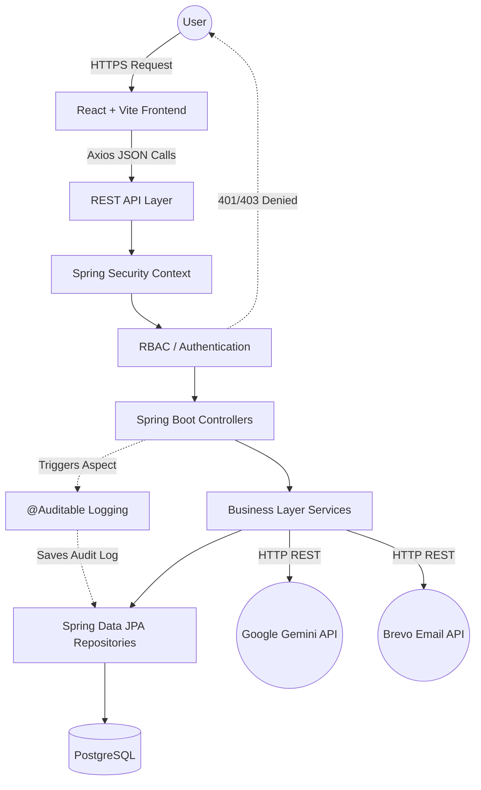

# 🛡️ SentinelCore-SecureOps

### Enterprise Security Operations & Threat Management Platform

SentinelCore-SecureOps is a unified Security Operations Center (SOC) platform designed to centralize and automate organizational security workflows. The platform provides real-time visibility into infrastructure health, incident response, vulnerability patching, compliance alignments, and audit logging. Supported by an integrated AI security assistant and automated email reporting, it serves as a lightweight command hub connecting critical telemetry data with actionable response operations governed by a strict Role-Based Access Control (RBAC) architecture.

[](https://openjdk.org/)
[](https://spring.io/projects/spring-boot)
[](https://react.dev/)
[](https://vitejs.dev/)
[](https://www.postgresql.org/)
[](https://www.docker.com/)

**Quick Links:**
* [Documentation Directory](./docs)
* [API Reference](./docs/api/api_reference.md)
* [Backend Documentation](./backend/README.md)
* [Frontend Documentation](./frontend/README.md)

---

## 2. Project Overview

Modern security monitoring requires orchestrating diverse domains: host inventories, incident response cycles, vulnerability databases, and regulatory compliance scopes. Traditionally, security teams have had to navigate independent, isolated tools to obtain a holistic view of the organization's threat posture, significantly increasing operational overhead and slowing incident remediation times.

SentinelCore-SecureOps solves this fragmentation by consolidating essential SecOps disciplines into a centralized operational interface. It replaces disparate spreadsheets and basic CRUD tools with a dedicated, authorization-driven platform where analysts, engineers, and auditors can collaborate on incidents, enforce policy standards, and maintain strict trails of sensitive operations.

---

## 3. Core Capabilities

| Module | Capability |
| :--- | :--- |
| **Executive Dashboard** | Centralized security posture overview with real-time metrics and incident trends. |
| **Asset Management** | Track, manage, and inventory organizational infrastructure assets. |
| **Incident Response** | Create, assign, manage, and resolve security incident tickets. |
| **Vulnerability Management** | Monitor CVEs, vulnerability severity, and remediation statuses. |
| **Compliance** | Monitor operational visibility into compliance frameworks (SOC 2, ISO 27001). |
| **Audit Logging** | Centralized audit trail for tracking security-sensitive operations. |
| **Reports** | Generate executive summaries and security status reports. |
| **Automated Delivery** | Dispatch reports automatically via transactional email delivery. |
| **AI Assistant** | Security-focused natural-language assistance leveraging Google Gemini. |
| **RBAC** | Fine-grained, 9-role permission-based authorization model. |
| **Authentication** | Secure, session-based authentication backed by Spring Security layer. |

---

## 4. ⭐ Security Architecture

### Authentication
User authentication is managed comprehensively by **Spring Security 6**.
- **Credentials & Hashing:** Utilizes traditional Username/Password form login protected by industry-standard `BCrypt` password hashing.
- **Sessions:** Relies on stateful, authenticated runtime sessions generating secure `JSESSIONID` cookies.
- **Security Posture:** Cookies are strictly managed utilizing `HttpOnly`, `Secure`, and cross-site configuring via `SameSite=None` attributes.

### Authorization (RBAC)
The application enforces strict **Role-Based Access Control (RBAC)** across the platform. While authentication determines _who_ the user is, authorization dictates exactly _what_ that user is allowed to do.

The platform relies on **20 distinct permissions** spanning endpoints and operations globally.

### Roles and Permissions Matrix
The platform defines 9 hierarchical roles enforcing targeted access boundaries mapped directly against 20 permissions.

| Role                   | Assets | Incidents | Vulnerabilities | Audit | Reports | Admin |
| ---------------------- | ------ | --------- | --------------- | ----- | ------- | ----- |
| **Super Admin**        | Full   | Full      | Full            | Full  | Full    | Full  |
| **Admin**              | Full   | Full      | Full            | Full  | Full    | Full  |
| **SOC Manager**        | View   | Manage    | —               | View  | Export  | —     |
| **Security Analyst**   | View   | Manage    | Manage          | —     | Export  | —     |
| **Incident Responder** | View   | Manage    | —               | View  | —       | —     |
| **Infra Engineer**     | Full   | View      | —               | —     | Export  | —     |
| **DevSecOps**          | Manage | Manage    | Manage          | —     | Export  | —     |
| **Auditor**            | View   | View      | —               | View  | Export  | —     |
| **Viewer**             | View   | View      | —               | —     | —       | —     |

---

## 5. 🔐 Security Controls

* **Spring Security 6 Pipelines:** Core security interception dictating endpoint exposure and API filtering.
* **Authentication Context Mapping:** Validating current executing principles against the SQL database.
* **Granular Role Checks:** Extensive endpoint-level authority evaluations using `@PreAuthorize`.
* **CSRF Mitigation:** Cookie-based CSRF tokens (`XSRF-TOKEN`) via `CookieCsrfTokenRepository.withHttpOnlyFalse()` with exclusion configurations explicitly covering the stateless API boundaries.
* **CORS Configurations:** Allowed origins mapping protecting against cross-origin data exposure while enabling secure credential integrations.
* **AOP Auditing:** Centralized logging intercepting modifying actions without cluttering core business service logic (detailed below).

---

## 6. 📝 Audit Logging & AOP

The repository leverages **Aspect-Oriented Programming (AOP)** to track security-sensitive modifications, providing a centralized audit trail isolated from standard business logic.

### `@Auditable`
Security-sensitive controller endpoints are decorated with a custom `@Auditable(action = "EXPECTED_ACTION")` annotation. 

### `AuditAspect`
The `AuditAspect` class natively intercepts requests bearing the `@Auditable` annotation. Utilizing Spring's Security Context, the aspect retrieves and writes the following payload synchronously into the `audit_logs` database table:
* The **Authenticated User** performing the action.
* The explicit **Roles/Authorities** assigned to that user.
* Request **IP Address**.
* Submitter **User-Agent** (Truncated defensively to 250 characters).
* Standard **Action Name** (e.g. `ASSET_CREATE`).
* Execution **Result Status** (`SUCCESS` vs `FAILED: exception message`).

This separates the audit concerns from core business logic, maintaining a centralized and consistent record of security-sensitive operations.

---

## 7. 📊 Executive Security Dashboard

The executive dashboard is the primary ingress interface offering top-level security metric consolidations visually mapped from database aggregates:
* Live asset counts representing registered infrastructure.
* Dynamic incident aggregation counters sorted by status and active severities.
* Security operations trend mappings showcasing past alert/incident velocities.
* Centralized panes broadcasting localized recent alerts and system activity.

---

## 8. 🖥️ Asset Management

Asset management consolidates data sets associated with the organization’s network endpoints, servers, and firewall architectures.
* End-to-end CRUD (Create, Read, Update, Delete) implementations interacting with the `Asset` database models.
* Tracks host classifications alongside generic status and operational location fields.
* Restricted effectively via `ASSET_*` tiered RBAC permissions preventing unauthorized infrastructure mutability. 

---

## 9. 🚨 Incident Response

Incidents are orchestrated through customized lifecycle tickets.
* Users holding `INCIDENT_CREATE` authority can originate threat tickets declaring specifics like severity and system targets.
* Operational roles monitor ticket states (Open, Investigating).
* Authoritative roles holding `INCIDENT_RESOLVE` map solution architectures directly concluding ticket workflows matching SLA timers and resolution validations.

---

## 10. 🐛 Vulnerability Management

Provides operations tracking tied to active Common Vulnerabilities and Exposures (CVE). 
* Dashboards highlighting base criticality, calculated severities, and targets affected.
* Granular documentation surrounding designated remediation playbooks (e.g., 'Deploy patches', 'Verify firewall mappings').
* Functionality explicitly protected verifying `VULN_MANAGE` directives.

---

## 11. 📋 Compliance Monitoring

Provides operational visibility into compliance posture against three integrated, hardcoded frameworks:
* ISO/IEC 27001
* SOC 2 (Trust Services Criteria)
* PCI DSS V4.0

The interface outputs percentage-based scorecards corresponding to successful mapped operations controls versus required framework standards.

---

## 12. 📑 Security Reporting

Automated reporting implementations extract backend statistical snapshots delivering PDF documents utilizing PDF generation integrations:
* Configurable email recipients for organizational targeting.
* Integrates directly with the `ScheduledReportController` targeting executive incident reviews and asset status aggregates.
* Protected inherently by the `REPORT_EXPORT` security parameter.

---

## 13. 📧 Automated Report Delivery

SentinelCore actively interfaces with the **Brevo API** delivering email notifications to users securely. 
* Triggered directly by the backend REST `EmailController` logic.
* Configured using `RestTemplate` dispatches interacting natively with Brevo backend API configurations.
* Handles transactional emails attached directly to high-threat threshold variables originating inside the platform operations interface.

---

## 14. 🤖 AI Security Assistant

An interactive AI-Assistant embedded inside the frontend interface connects analysts via Natural Language interfaces.
* Integrated specifically with the **Google Gemini API** (using the `gemini-1.5-pro` model).
* Functions as a context-aware fallback. Rule-based parsers intercept static known-flow inquiries (e.g. "Create an asset") preventing unnecessary API usage, while Google Gemini translates and responds to broader cyber queries.
* Built utilizing unified backend `GeminiService` communication configurations ensuring standard frontend requests remain opaque to internal system API keys.

---

## 15. 🏗️ System Architecture



---

## 16. 🔒 How a Request is Secured

To understand the core security flow of the application, every incoming API request is vetted thoroughly across distinct layers before interacting with the PostgreSQL database.

**401 Unauthorized vs. 403 Forbidden**
* **401 Unauthorized**: Returned if the user lacks a valid `JSESSIONID` cookie or presents invalid credentials. Represented by the *Authentication* layer rejecting the request.
* **403 Forbidden**: Returned if the user is authenticated, but their assigned operational role lacks the specific *Permission/Authority* mapped to that endpoint. 

```text
Incoming API Request
       ↓
[ Spring Security Filter Chain ]
       ↓
Authentication Check (Is the user logged in? → 401 if No)
       ↓
Granted Authorities Loaded (Assigned Roles & Permissions)
       ↓
@PreAuthorize Method Check (Does the user have the required permission? → 403 if No)
       ↓
Controller Execution
       ↓
Service Logic
       ↓
Repository Layer
       ↓
PostgreSQL Database
```

---

## 17. 📁 Project Structure

```text
SentinelCore-SecureOps/
├── backend/
│   ├── src/
│   │   ├── main/
│   │   │   ├── java/com/prashanth/dashboard/
│   │   │   │   ├── aop/             # Aspect-Oriented audit logging logic
│   │   │   │   ├── controller/      # REST API endpoints
│   │   │   │   ├── dto/             # Data Transfer Objects
│   │   │   │   ├── model/           # JPA Entities (Asset, Role, Incident, etc.)
│   │   │   │   ├── repository/      # Spring Data JPA Repository bindings
│   │   │   │   ├── security/        # Spring Security config, user details & CORS
│   │   │   │   └── service/         # Business logic layer (Gemini, Email, etc.)
│   │   │   └── resources/
│   │   │       ├── application.properties
│   │   │       └── static/
│   │   └── test/
│   ├── pom.xml
│   └── Dockerfile
├── frontend/
│   ├── src/
│   │   ├── components/  # Reusable React layout items and UX modals
│   │   ├── context/     # Globally scoped context bindings (AI State, Auth State)
│   │   ├── pages/       # Fully rendered Dashboard SPA views
│   │   ├── services/    # Axios implementations isolating backend calls
│   │   └── styles/      # Vanilla modular CSS
│   ├── package.json
│   ├── vite.config.js
│   └── index.html
├── docs/
│   ├── api/
│   ├── architecture/
│   ├── deployment/
│   └── security/
├── docker-compose.yml   # Multi-container orchestration instructions
├── render.yaml          # External platform continuous deployment configurations
└── README.md
```

---

## 18. 🧩 Technology Stack

| Category | Technology |
| :------- | :--------- |
| **Backend** | Java 17, Spring Boot 3, Spring Data JPA, Hibernate, Maven |
| **Frontend** | React 19, Vite, Axios |
| **Database** | PostgreSQL 15 |
| **Security** | Spring Security 6, BCrypt, RBAC, Core CORS Configurations, State-managed Cookies |
| **Infrastructure** | Docker, Docker Compose, Render Cloud Runtime |
| **Integrations** | Brevo API (Transactional Emails), Google Gemini API (AI Ops) |

---

## 19. 🔌 REST API Overview

Below represents a highly condensed summary of module endpoints. For exhaustive specifications, reference the full [API Reference Documentation](docs/api/api_reference.md).

| Module | Example Endpoint | Purpose |
| :--- | :--- | :--- |
| **Authentication** | `POST /login` | Validates session initiation mappings. |
| **Users** | `GET /api/users` | Lists active internal system operations staff. |
| **Dashboard** | `GET /api/dashboard/stats` | Aggregates high-value system metrics (Incidents, Assets). |
| **Assets** | `POST /api/assets` | Provisions new managed servers and endpoints. |
| **Incidents** | `PUT /api/incidents/{id}/status` | Updates incident status queues programmatically. |
| **Vulnerabilities** | `GET /api/vulnerabilities` | Identifies all evaluated active system CVE datasets. |
| **Compliance** | `GET /api/compliance` | Queries matrix compliance frameworks comparisons. |
| **Audit** | `GET /api/audit-logs/recent` | Validates standard system operations inputs internally. |
| **Integrations** | `POST /api/alerts/send-email` | Dispatches priority email escalations using Brevo. |
| **AI** | `POST /api/ai/chat` | Leverages Gemini / Rule integrations for data context assistance. |

---

## 20. 🐳 Docker & Deployment

The application features full container orchestration methodologies utilizing explicit `Dockerfile` parameters located in `/backend` combined with an orchestration strategy maintained via `docker-compose.yml`.
* **Local Run:** Composes standard `postgres:15` images synchronously initialized alongside the Maven-built `backend` server.
* **Production Build:** Platform explicitly mapped for Render deployment schemas (`render.yaml`) establishing managed PostgreSQL components alongside the stateless Java operations layer, establishing strict internal connectivity references preventing unbounded public exposure variables.

---

## 21. ⚙️ Environment Variables

Important system variables managed via `.env` parameter mappings or strictly encrypted platform variables. *(Note: Actual credential combinations are managed separately).*

```env
# Relational Database References
DB_URL=
DB_USERNAME=
DB_PASSWORD=

# Session / Backend Host URLs
FRONTEND_URL=
PORT=

# 3rd Party Integrations
BREVO_API_KEY=
BREVO_SENDER_EMAIL=
BREVO_SENDER_NAME=

GEMINI_API_KEY=
```

---

## 22. 🚀 Running Locally

### Prerequisites
* Java 17+
* Node.js / NPM
* PostgreSQL (Running natively or via Docker)
* Maven Wrapper

### Backend Startup
```bash
cd backend
./mvnw clean install
./mvnw spring-boot:run
```

### Frontend Startup
```bash
cd frontend
npm install
npm run dev
```

### Docker Orchestration (Alternatively)
To run sequentially via docker variables skipping local manual executions:
```bash
docker-compose up --build
```
> *(Requires `docker` daemon running successfully)*

---

## 23. 🧪 Testing & Validation

Validation environments established verifying logical code mappings explicitly.
* Evaluates standardized JUnit testing environments tracking standard Controller validation formats.
* Tests explicitly mock outbound dependencies mapping utilizing standard Mockito injections isolating AI endpoints ensuring test speeds and avoiding unpredictable API expenditures explicitly.

---

## 24. 📚 Documentation Directory

Exhaustive references concerning explicit SentinelCore architecture mappings and implementation data formats are localized in the primary deployment documents:
* [Architecture Overview](./docs/architecture/architecture_overview.md)
* [API Reference Listing](./docs/api/api_reference.md)
* [Security & RBAC Configurations](./docs/security/security_rbac.md)
* [Comprehensive Deployment Guide](./docs/deployment/deployment_guide.md)

---

## 25. 🎯 Project Highlights for Recruiters

SentinelCore-SecureOps demonstrates strong enterprise IT and cybersecurity architectural patterns:
* Fine-grained Role-Based Access Control (RBAC)
* 9 operational roles mapping 20 distinct system permissions
* Spring Security 6 integration restricting controller/service boundaries
* BCrypt password hashing and session-based authentication flows
* Aspect-Oriented Programming (AOP) audit logging separating operational tracking from business logic
* Enterprise Java Controller-Service-Repository patterns via Spring Boot
* Modular RESTful API architecture
* Relational persistence via Spring Data JPA and PostgreSQL
* React 19 SPA frontend with component-based state management
* Automated PDF report generation workflows
* Transactional email alert delivery (Brevo API)
* AI command context assistant integration (Google Gemini API)
* Predictable Docker-compose orchestration
* Continuous deployment mapping (Render configurations)

---

## 26. 👨‍💻 Engineering Architecture Principles

Implementation highlights stringent programmatic discipline standards established globally:
* **Explicit Separation of Concerns:** Logic distributed cleanly utilizing Controller -> Service -> Repository definitions strictly.
* **Single-Responsibility Endpoints:** REST structures mapped adhering properly to HTTP noun paradigms.
* **Component Context Management:** Utilizing React Context wrappers preserving authentication profiles natively without excessive backend polling.
* **Decoupled API Logic:** Mapping frontend `axios` interceptors ensuring consistent configurations for credentials natively.

---

## 27. 📸 Screenshots

> Screenshots will be added soon once the production design is finalized.