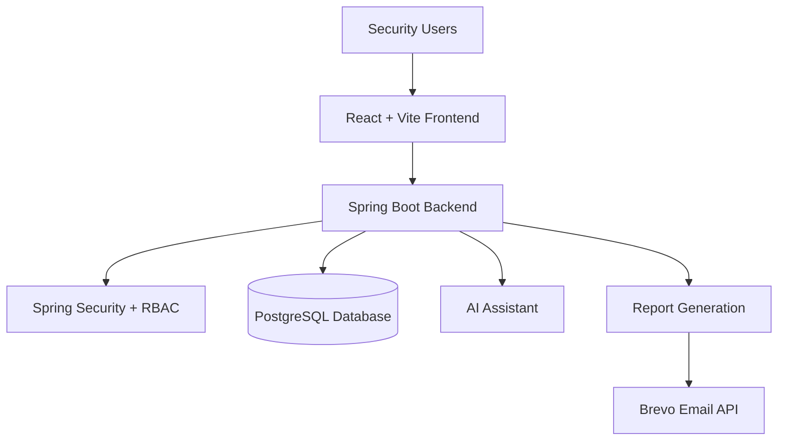

# System Architecture Overview

SentinelCore-SecureOps is implemented as a decoupled, multi-tiered enterprise web application. It follows a client-server architecture with a clear separation of concerns between the user interface and the business logic layers.

## 📐 Conceptual Flow Diagram

## 🏗️ Monorepo Component Layers

### 1. Presentation Layer (Frontend Client SPA)
- **Technology Stack**: React 19, Vite, React Router DOM, HSL custom dark styling.
- **Role**: Provides a modern, responsive, and aesthetically polished UI/UX dashboard for SOC managers, security analysts, and compliance auditors. It retrieves metrics, manages incidents, scales simulated components, visualizes threat telemetry, and contains an interactive chat drawer for real-time natural language query support.
- **Authentication Handshake**: Authenticates users credentials against Spring Security, holding onto credential states utilizing React Context Provider (`AuthContext`). All requests are proxied via `axiosInstance` with session credentials automatically carried in standard HttpOnly cookies (`JSESSIONID`).

### 2. Security and Middleware Layer
- **Technology Stack**: Spring Security 6, custom `UserDetailsService`, custom access denial interceptors (SweetAlert2 notifications).
- **Session Management**: Session credentials are stored using secure cross-site cookies, explicitly enabling `SameSite=None` and `Secure=true` flags to ensure frontend-to-backend communication operates correctly when CORS requests traverse Vercel and Render cloud interfaces.
- **RBAC Filters**: Dynamically intersects all endpoint URLs and verifies required authority claims using annotations like `@PreAuthorize` before passing execution control to controllers.

### 3. Business Logic and Controller Layer (REST Backend Service)
- **Technology Stack**: Spring Boot 3, Spring MVC Controllers, Spring Data JPA Repositories.
- **Core Operations**: Outlines endpoints, consumes incoming request maps (DTOs), conducts transaction checks, performs mathematical trend computations, database pagination, and delegates email notification requests.
- **Aspect-Oriented Audit (Spring AOP)**: Intercepts controllers decorated with custom `@Auditable` tags, extracting transaction details (including IP address, browser User-Agent strings, username, and query status). User-Agents are dynamically sanitized to prevent PostgreSQL database buffer limit runs before logs are persisted.

### 4. Background Services & Integrations
- **Document Generation Engine (OpenPDF)**: Compiles tabular summaries into PDF structures dynamically, adding security watermarks and document pagination.
- **Brevo REST Mail Dispatcher**: Sends notifications, password resets, and audit metrics to target analysts as planned by the `ReportScheduler` cron thread or direct manual action.
- **xAI / Grok SecOps Assistant**: Processes contextual security queries offline through securely routed POST calls to the Grok API, returning diagnostic references to the client.

### 5. Persistent Data Store
- **Technology Stack**: PostgreSQL 15, Spring JPA / Hibernate, Neon Serverless integrations.
- **Schema Management**: Maps entities (`User`, `Role`, `Permission`, `Asset`, `Incident`, `Vulnerability`, `AuditLog`, `Alert`) into relational database tables. Tables are auto-migrated during local bootstrapping and seed core roles and supervisor assets.
